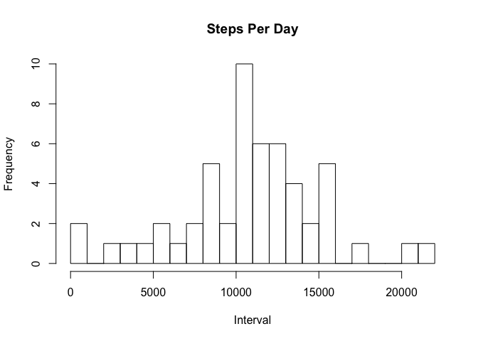
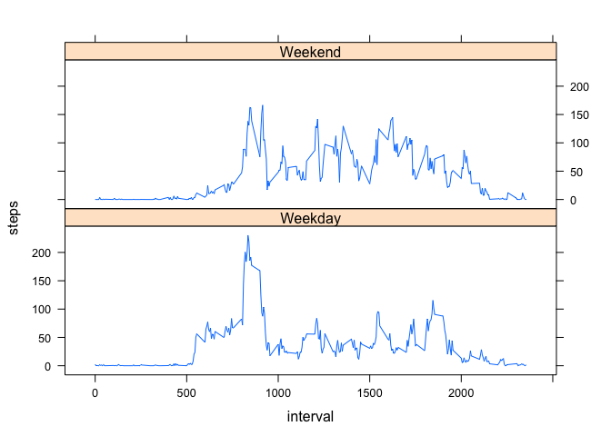

# Reproducible Research: Peer Assessment 1
##Load data
The data is in the working directory already and is ready for the analysis. It is read into a datatable.


```r
## Loading and preprocessing the data
data<-read.csv("activity.csv")
```

##Calcluate total steps per day
The mean total steps per day is calculate by first calculating the total per day the calculating the mean of days.

```r
## What is mean total number of steps taken per day?
stepsperday<-aggregate(steps ~ date,data, sum)
```
This is a histogram of steps per day for all days

```r
hist(stepsperday$steps, breaks = 20, main ="Steps Per Day",xlab="Interval")
```

 

The mean and median steps per day are displayed below:

```r
test<-summary(stepsperday$steps)
test[3:4]
```

```
## Median   Mean 
##  10760  10770
```

##Daily Activity Pattern
The mean for each interval is calculated and plotted

```r
## What is the average daily activity pattern?
stepsbyinterval<-aggregate(steps ~ interval,data, mean)
plot(stepsbyinterval, type="l")
```

 

Find the interval with the maximal average number of steps. The data is sorted by the mean number of steps in the intervals and the top row returned.

```r
stepsbyinterval[order(stepsbyinterval$steps,decreasing=T)[1],]
```

```
##     interval    steps
## 104      835 206.1698
```
The number agrees with the graph above.

##Imputing missing values
First find the number of missing values in the full dataset

```r
## Imputing missing values
sum(is.na(data$steps))
```

```
## [1] 2304
```

Now replace the missing data with the mean steps by interval calculated above. The interval means are added as a new variable to the data by interval. Then an index of which rows have missing data is created. The index is used to decide which rows need to have their missing data replaced by the interval mean.

```r
names(stepsbyinterval)[2]<-"intmean"
dataFull<-merge(data,stepsbyinterval,by.x="interval")
naIndex<- which(is.na(dataFull$steps))
dataFull$steps[naIndex]<-dataFull$intmean[naIndex]
```

Now we calculate the mean steps per interval across all dates on the new data set with interpolated data and display the histogram again

```r
stepsperdayFull<-aggregate(steps ~ date,dataFull, sum)
hist(stepsperday$steps, breaks = 20, main ="Steps Per Day",xlab="Interval")
```

 

The graph looks similar. Compare the mean and median for the interpolated dataset to to original:

```r
testFull<-summary(stepsperday$steps)
testFull[3:4]
```

```
## Median   Mean 
##  10760  10770
```

```r
test[3:4]
```

```
## Median   Mean 
##  10760  10770
```
The numbers are the same since the interpolated data was the mean.
##Compare weekend and weekdays
I used the "chron" library to create a new variable as afactor for Weekend vs Weekday in the interpolated data set. Then the mean steps per inteval is calculatedseparating by the weekend/weekday factor. The patterns are graphed.

```r
## Are there differences in activity patterns between weekdays and weekends?
library("chron")
dts<-as.Date(dataFull$date)
dataFull$isWeekEnd<-as.factor(ifelse(is.weekend(dts),"Weekend","Weekday"))
stepsbyintervalFull<-aggregate(steps ~ interval+isWeekEnd,dataFull, mean)
```


```r
library(lattice)
xyplot(steps~interval|isWeekEnd, stepsbyintervalFull, type="l",layout=c(1,2))
```

 
